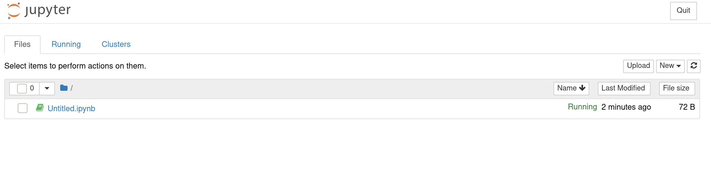
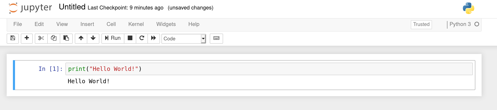

# Setting up Notebook-Controller on OpenShift 4.x

*Before following this tutorial, please make sure the changes from [this commit](https://github.com/4n4nd/kubeflow/commit/37d12b6bfec40f9942f7d407324306b2f3f67256) have been applied.*

## Update Makefile

* Update Makefile with your own notebook-controller container image:

  ```Makefile
  # Image URL to use all building/pushing image targets
  IMG ?= quay.io/4n4nd/notebook-controller
  ```

## Build notebook-controller container image

* Run `make docker-build` to build a notebook-controller container image locally from source.

* Run `make docker-push` to push your newly built image to your image registry. <br>
  Make sure this registry is accessible by your OpenShift environment.

## Deploy the Notebook-Controller

*Make sure you have enough privileges to create CRDs and ClusterRoles in your OpenShift environment before deploying the controller*

* Run `make deploy` to create all the required CRDs in your OpenShift environment
  and also deploy the notebook-controller in a newly created namespace called `notebook-controller-system`.

## Test the Notebook-Controller

* Create a test namespace called `notebook-test` by running the following command: <br>
  `oc new-project notebook-test`

* Lets create a PVC that we will attach to our Notebook pod: <br>
  `oc apply -f loadtest/jupyter_pvc.yaml -n notebook-test`

* Now we need to create a Notebook CR: <br>
  `oc apply -f loadtest/jupyter_test.yaml -n notebook-test`

  If the Notebook-Controller has been set up properly, this should create a new StatefulSet in the `notebook-test` namespace.

* To test if the Notebook server works, we can expose the `jupyter-test` Service that was created with the StatefulSet: <br>
  `oc expose svc jupyter-test --path=/notebook/test-notebook/jupyter-test -n notebook-test`

  After exposing the Service, you should see a new Route created in the `notebook-test` namespace. <br>
  If you are using [CodeReady-Containers](https://developers.redhat.com/products/codeready-containers/overview), it might look similar to this: <br>
  http://jupyter-test-test-notebook.apps-crc.testing/notebook/test-notebook/jupyter-test

## Test the Jupyter environment

* Click on the newly created Route and you should be able to see a Jupyter Notebook Environment

  

* Try creating a new notebook and check if the python kernel works.

  
